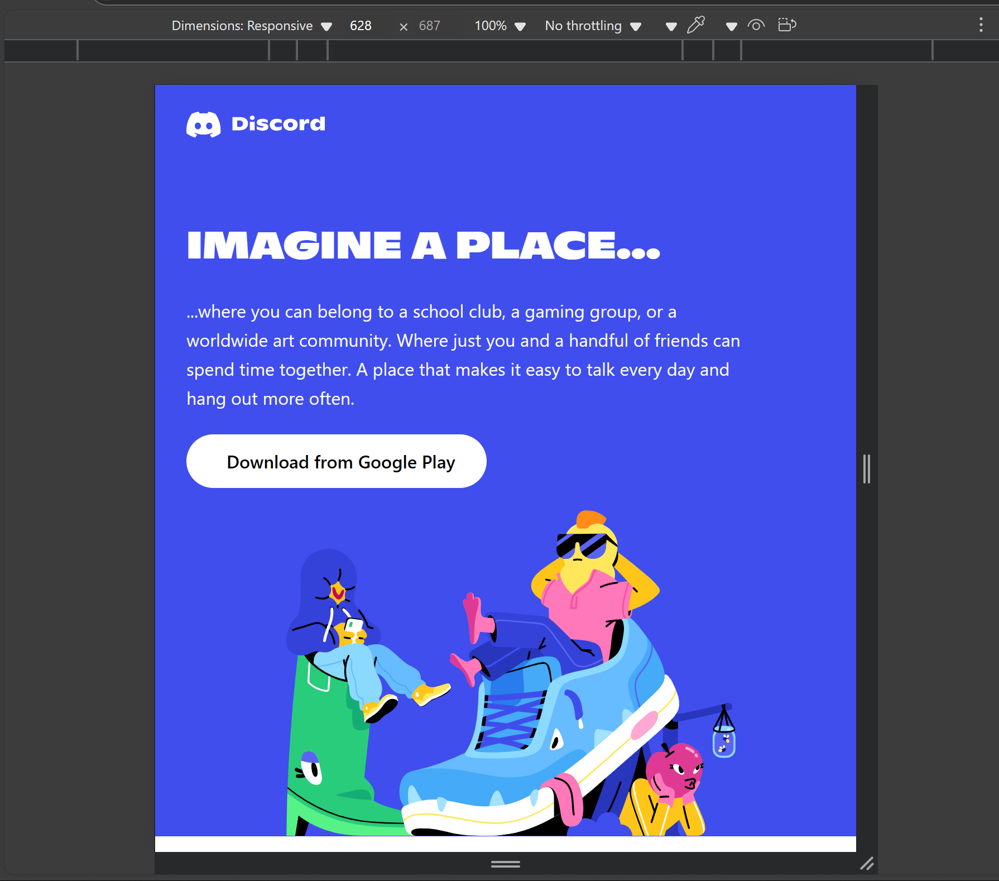
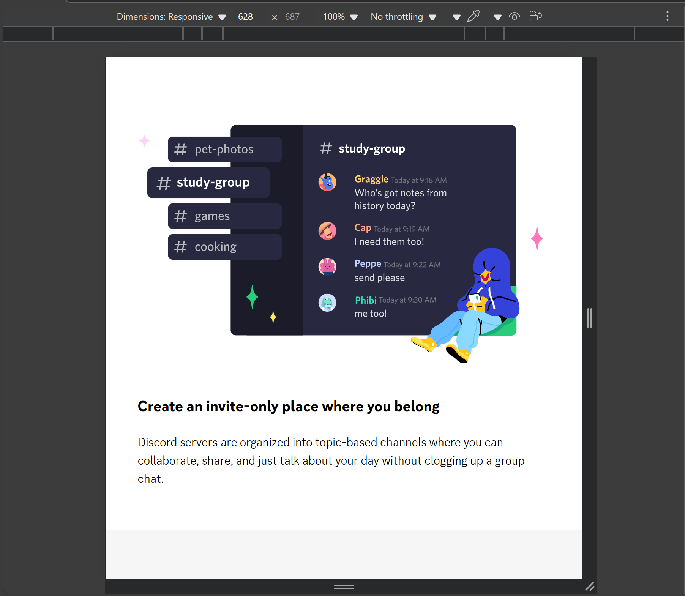

# Discord Landing Page Clone

A fully responsive and feature-rich clone of the official [Discord](https://discord.com/) landing page built using **HTML**, **Tailwind CSS**, and **custom fonts**. This project replicates the UI structure and style of Discord’s homepage with pixel-perfect accuracy.

---

##  Overview

This project aims to practice and demonstrate modern frontend development using:

- Utility-first CSS with Tailwind
- Mobile-first responsive layout
- Semantic HTML structure
- Custom typography and asset handling

---

##  Project Structure

```
discord-landing-page/
│
├── fonts/                # Custom fonts (Whitney, Ginto, GintoNord, ggSans)
├── images/               # All image assets used in the project
├── node_modules/         # Installed dependencies (Tailwind, PostCSS)
│
├── index.html            # Main HTML file
├── main.css              # Tailwind directives + custom font imports
├── postcss.config.js     # PostCSS configuration for Tailwind
├── tailwind.config.js    # Tailwind customization file
│
├── package.json          # Project metadata and scripts
├── package-lock.json     # Locked dependency versions
├── .gitattributes        # Git configuration
└── README.md             # Project documentation
```

---

## Features

-  **Responsive Design** – Works across devices (mobile, tablet, desktop)
-  **Tailwind CSS** – Clean, scalable, and utility-first styling
-  **Custom Fonts** – Whitney, Ginto, and ggSans fully integrated
-  **Performance-Optimized** – No heavy JavaScript, fast-loading static site
-  **Modular Sections** – Hero, Features, CTA, Footer

---

## Installation & Setup

1. **Clone the repository**
   ```bash
   git clone https://github.com/ArshnoorSingh07/Discord-Clone.git
   cd Discord-Clone
   ```

2. **Install dependencies**
   ```bash
   npm install
   ```

3. **Run Tailwind in watch mode**
   ```bash
   npx tailwindcss -i ./main.css -o ./dist/output.css --watch
   ```

4. **Open `index.html`** in your browser (you can use Live Server or any static server).

---

##  Live Demo

You can deploy this static site using:

- GitHub Pages
- Vercel
- Netlify

---

##  Screenshots

# Desktop View


# Mobile View



---

##  Dependencies

- [Tailwind CSS](https://tailwindcss.com/)
- [Font Awesome](https://fontawesome.com/)
- Custom Fonts (Whitney, Ginto, ggSans)

---

##  License

This project is intended for **educational and learning purposes only**. It is not affiliated with or endorsed by Discord Inc

---

##  Acknowledgements

- Design inspired by [Discord.com](https://discord.com/)
- Icons from [Font Awesome](https://fontawesome.com/)
- Fonts integrated from custom resources

---

##  Author

**Arshnoor Singh**  
[GitHub Profile](https://github.com/ArshnoorSingh07/)
